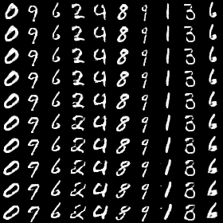

# Tested on:
> python 3.5 and TF 1.3

# InfoGAN implementation (https://arxiv.org/abs/1606.03657)

## One regularized variable - Categorical

comment the proper line in main_v0.py
```
$ python main_v0.py
```
After 1st epoch


After 5th epoch


After 9th epoch


Losses


## One regularized variable - Uniform
comment the proper line in main_v0.py
```
$ python main_v0.py
```
After 1st epoch


After 5th epoch


After 9th epoch


Losses


## Two regularized variables - Categorical viz
comment the proper line in main_v1.py
```
$ python main_v1.py
```
After 10st epoch


After 50th epoch


After 79th epoch


Losses


## Two regularized variables - Uniform viz
comment the proper line in main_v1.py
```
$ python main_v1.py
```
After 10st epoch



After 50th epoch


After 79th epoch


Losses


# Links

- (https://arxiv.org/abs/1606.03657)
- (https://github.com/awjuliani/TF-Tutorials/blob/master/InfoGAN-Tutorial.ipynb)
